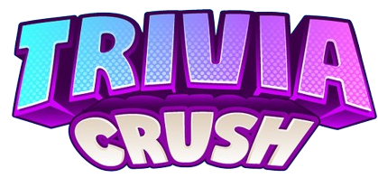
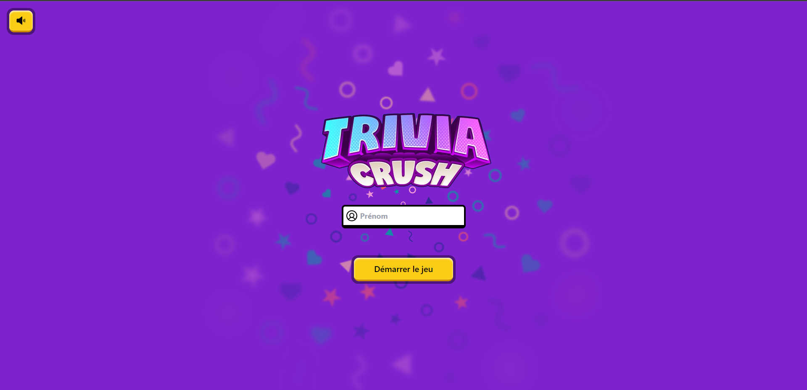
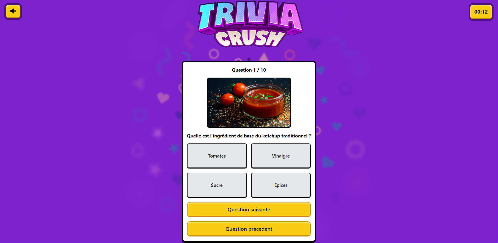
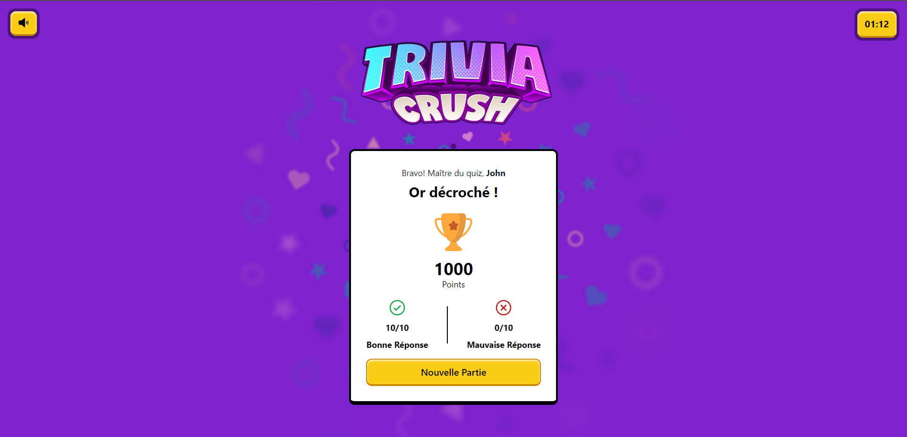

# Trivia Crush - Quiz - Theme : Kechup

**Trivia Crush** is a collaborative project crafted by Team Ketchup. As a team, we embarked on an exciting journey to create a captivating quiz centered around the beloved condiment – ketchup! The quiz comprises 10 intriguing questions designed to test your knowledge of this iconic sauce.





## How to Play

The goal is simple: accumulate as many points as possible by answering the questions correctly. Each correct answer brings you one step closer to becoming a ketchup connoisseur. Challenge yourself, compete with friends, and see who can achieve the highest score in this fun and informative quiz.
## Features

- **10 Engaging Questions :** Test your knowledge with a carefully curated set of 10 questions about ketchup – from its history to fun facts and usage.

- **Score Tracking :** Keep track of your progress with a built-in scoring system. Strive for perfection and aim to the Gold Trophy.

- **Timer :** Experience the thrill of racing against the clock! Complete the quiz in the shortest time possible, showcasing your ketchup expertise.


## Getting Started

    Go to live website :

#### Or
    1. Clone the repository.
    2. Open the index.html file in your browser.
    3. Answer each question to the best of your knowledge.
    4. Check your score and challenge your friends to beat it!
## Run Locally

Clone the project

```bash
  git clone https://github.com/Khaledik/ketchup
```


## Authors

- [@maximehery](https://github.com/maximehery)
- [@Selkyn](https://github.com/Selkyn)
- [@caro30a](https://github.com/caro30a)
- [@Dylantrgt](https://github.com/Dylantrgt)


## Tech Stack

**Client:** HTML, Tailwind, Javascript


## Screenshots





